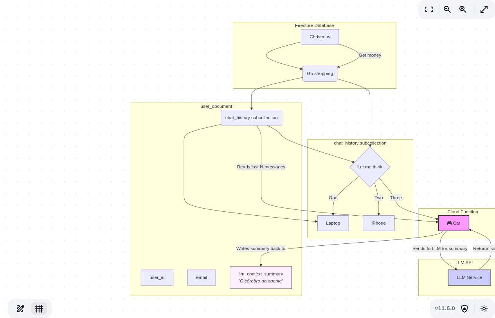

# Proposta de Arquitetura para Agente Personalizado com LLM

Este documento detalha uma proposta de arquitetura para a implementação de um agente de IA personalizado no aplicativo, utilizando o Firebase como backend e uma Large Language Model (LLM) para as interações de chat.

## 1. Análise de Viabilidade: Firebase (Plano Spark)

A primeira questão é se o plano gratuito do Firebase (Spark) é suficiente para suportar a funcionalidade de chat com LLM na fase inicial do projeto. A conclusão é **sim, com folga**.

O plano Spark foi projetado para permitir o desenvolvimento e lançamento de um MVP sem custos.

### Limites do Firestore (Banco de Dados)

-   **Gravações:** 20.000 / dia
    -   **Tradução Prática:** Cada mensagem enviada pelo usuário é **1 gravação**. Com uma média de 20 mensagens por usuário/dia, o plano suportaria **1.000 usuários ativos diariamente**.
-   **Leituras:** 50.000 / dia
    -   **Tradução Prática:** Carregar o histórico de um chat consome leituras. Se o histórico inicial tem 20 mensagens, são **20 leituras**.
-   **Armazenamento:** 1 GiB total
    -   **Tradução Prática:** O texto das conversas ocupa pouquíssimo espaço. 1 GiB é um volume que só seria atingido com uma base de usuários muito grande e ativa por um longo período.

### Limites do Cloud Functions

-   **Invocações:** 125.000 / mês
    -   **Tradução Prática:** Este é o limite mais relevante. Cada mensagem que exige uma resposta do LLM acionará **1 invocação**. O limite permite um volume considerável de interações para validação inicial.
-   **Tempo de Computação:** 40.000 GB-segundos / mês
    -   **Tradução Prática:** É improvável atingir este limite antes do limite de invocações.

**Conclusão sobre o Plano Spark:** O plano gratuito é mais do que suficiente para lançar, validar a ideia e atrair centenas de usuários ativos diários sem incorrer em custos.

---

## 2. Arquitetura de Dados Otimizada: O Agente com "Memória"

Para criar um agente personalizado que "lembra" do progresso do usuário de forma otimizada e econômica, propomos uma arquitetura baseada em **sumarização de contexto**.

### Modelagem no Firestore (Detalhada)

A estrutura de dados é desenhada para ser eficiente, separando o histórico de chat do perfil principal do usuário. Esta modelagem expandida considera os dados coletados em diferentes partes do aplicativo para fornecer uma base sólida para funcionalidades futuras.

```
/users/{user_id} (Documento do Usuário)
  |
  +-- uid: "aBCd123..." (ID do Firebase Auth, para referência)
  +-- email: "usuario@email.com"
  +-- name: "Nome do Usuário"
  +-- created_at: Timestamp
  |
  +-- // Dados da planta, para gamificação e engajamento
  +-- plant_info: {
  |     +-- name: "Ivy",
  |     +-- species: "Monstera",
  |     +-- level: 5,
  |     +-- growth_points: 1250
  |   }
  |
  +-- // O "CÉREBRO" DO AGENTE: Um resumo do estado atual do usuário
  +-- llm_context_summary: "Resumo da conversa focado no progresso do usuário."
  +-- plant_info: {
              name: "Ivy II",
              type: "Monstera"
           }
  |
  +-- /chat_history/{message_id} (Subcoleção de Mensagens)
        +-- text: "Hoje foi um dia difícil, mas não cedi."
        +-- sender: "user"
        +-- timestamp: Timestamp
```

### Diagrama do Modelo de Dados (Firestore)

```plaintext
+---------------------------------+
| users (collection)              |
+---------------------------------+
| [user_id] (document)            |
|   - uid: string (PK)            |
|   - name: string                |
|   - email: string               |
|   - plant_info: object          |
|   - llm_context_summary: string |
|                                 |
|   +---------------------------+ |
|   | chat_history (sub-coll)   | |
|   +---------------------------+ |
|   | [message_id] (document)   | |
|   |   - text: string          | |
|   |   - sender: string        | |
|   |   - timestamp: timestamp  | |
|   +---------------------------+ |
+---------------------------------+
```

### Diagrama da Arquitetura



### Como Funciona

1.  **Sumarização Periódica:** Uma Cloud Function é executada periodicamente (ex: ao fim de uma conversa). Ela lê as mensagens recentes da subcoleção `chat_history`.
2.  **Geração do Contexto:** A função envia o histórico recente para o LLM com um prompt para gerar um resumo conciso sobre o estado e progresso do usuário.
3.  **Armazenamento do Resumo:** O resumo gerado é salvo no campo `llm_context_summary` do documento principal do usuário.
4.  **Iniciando Novas Conversas:** Em vez de enviar todo o histórico de chat para o LLM a cada nova mensagem (o que seria lento e caro), o aplicativo envia apenas o `llm_context_summary` e a nova mensagem do usuário. Isso dá ao LLM o contexto necessário para uma resposta personalizada e inteligente.

### Vantagens desta Abordagem

-   **Economia:** Reduz drasticamente o número de tokens enviados à API do LLM, controlando os custos.
-   **Performance:** Diminui a latência, pois menos dados são trafegados.
-   **Escalabilidade:** A solução funciona de forma eficiente para uma base de usuários crescente.
-   **Personalização:** Mantém a continuidade e a "memória" do agente sem sobrecarregar o sistema.

## Próximos Passos Recomendados

O primeiro passo para implementar esta arquitetura é desenvolver a tela de **cadastro/login**, que criará a estrutura inicial do documento do usuário no Firestore. 