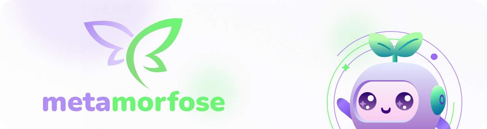

# 🦋 Metamorfose – Aplicativo de Superação de Vícios

> "Seu crescimento, sua jornada, sua metamorfose"

  

## 📱 Sobre o Projeto

Metamorfose é um aplicativo mobile que combina tecnologia, natureza e inteligência artificial para auxiliar pessoas na superação de vícios – sejam eles comportamentais, químicos ou tecnológicos. Inspirado pelos princípios da Sociedade 5.0, o projeto oferece uma abordagem humanizada, sensível e simbólica.

## 🛠 Pré-requisitos

- Flutter SDK 3.0 ou superior
- Dart 3.0 ou superior
- Android SDK: API 21 (Lollipop; Android 5.0) ou superior
- iOS: 11.0 ou superior
- Firebase (Authentication, Firestore, Storage)
- API da OpenAI
- Arquitetura Clean Architecture + BLoC

## 🌿 Funcionalidades Principais

> [!TIP]  
> O Metamorfose atua como um **guia interativo e emocional** durante a jornada de superação. Cada funcionalidade foi desenhada para manter o engajamento e reforçar a conexão entre o usuário e sua própria transformação.

- **Integração Planta Real + Digital**
- **IA como "Consciência da Planta"**
- **Interação por Voz ou Texto**
- **Métricas Inteligentes**
- **Registro Visual**
- **Botão SOS e Suporte Emergencial**
- **Comunidade Moderada**
- **Gamificação Emocional**

## 💡 Diferenciais

> [!IMPORTANT]  
> O Metamorfose se destaca por criar uma **experiência simbólica e sensível**. Mais do que funcionalidades, ele entrega propósito.

- Abordagem físico-digital simbólica e emocional  
- Gamificação significativa com evolução simbólica (borboleta)  
- IA adaptativa e empática, com resposta por voz ou texto  
- Conexão com a natureza como metáfora do crescimento pessoal  
- Alinhamento com os valores da Sociedade 5.0  

## 🏗️ Arquitetura e Estado Atual

### Migração BLoC Concluída ✅
O projeto passou por uma refatoração completa para a arquitetura BLoC, resultando em um código mais limpo, performático e escalável. Todas as telas principais foram migradas:
- **AuthScreen**: Sistema de login e cadastro com gerenciamento de estado via BLoC.
- **HomeScreen**: Carregamento de dados (clima, quotes) e notificações gerenciados pelo BLoC.
- **PlantConfigScreen**: Configuração da planta virtual com validações e lógica no BLoC.
- **VoiceChatScreen**: Interface de chat por voz reativa, controlada pelo BLoC.
- **MapScreen**: Localização de floriculturas com Google Maps, Places API e gerenciamento de estado BLoC.

### Melhorias Técnicas Realizadas
- **APIs de Quotes**: Substituição de API externa por uma lista local com mais de 40 frases em português, eliminando latência e garantindo relevância do conteúdo.
- **Validações Simplificadas**: Remoção de validações complexas na tela de configuração da planta para melhorar o fluxo de usuário.
- **Consistência de UI**: Ajustes finos de layout em telas como `Home` e `PlantConfig` para garantir espaçamento e alinhamento consistentes.
- **Roteamento Unificado**: O `AppRouter` foi refatorado para usar exclusivamente as versões BLoC das telas, com remoção de rotas de teste e código obsoleto.
- **Arquitetura Limpa**: O código-fonte foi limpo, com a remoção de arquivos `StatefulWidget` antigos (`map_screen.dart`) e constantes de rotas não utilizadas.

## 🚧 Próximos Passos

O projeto está em desenvolvimento e as próximas atualizações incluem:

- [ ] Implementação completa do voicebot (voz para IA)
- [ ] Comunidade moderada e funcionalidades sociais
- [ ] Gamificação avançada com evolução simbólica da borboleta

## 👥 Colaboradores

Agradecemos às seguintes pessoas que contribuíram para este projeto:

<table>
  <tr>
    <td align="center">
      <a href="https://github.com/vickyeqq">
         
        <b>Vitoria Lana</b>
      </a>
    </td>
    <td align="center">
      <a href="https://github.com/evamyuu">
         
        <b>Evelin Brandão</b>
      </a>
    </td>
    <td align="center">
      <a href="https://github.com/gabriel-steixeira">
         
        <b>Gabriel Souza</b>
      </a>
    </td>
    <td align="center">
      <a href="https://github.com/vncys">
         
        <b>Vinicyus Oliveira</b>
      </a>
    </td>
    <td align="center">
      <a href="https://github.com/ester-silvaa">
         
        <b>Ester Silva</b>
      </a>
    </td>
  </tr>
</table>

## 📝 Licença

Este projeto está sob licença MIT. Veja o arquivo [LICENSE](LICENSE) para mais detalhes.
