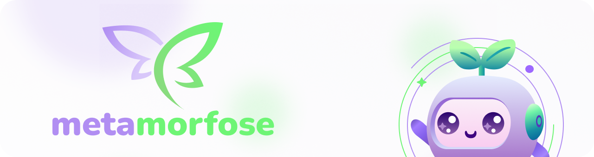

# 🦋 Metamorfose – Aplicativo de Superação de Vícios

> "Seu crescimento, sua jornada, sua metamorfose"


<p align="center">
  
</p>

## 📱 Sobre o Projeto

Metamorfose é um aplicativo mobile que combina tecnologia, natureza e inteligência artificial para auxiliar pessoas na superação de vícios – sejam eles comportamentais, químicos ou tecnológicos. Inspirado pelos princípios da Sociedade 5.0, o projeto oferece uma abordagem humanizada, sensível e simbólica.

## 🛠 Pré-requisitos

- Flutter SDK 3.0 ou superior
- Dart 3.0 ou superior
- Android SDK: API 21 (Lollipop; Android 5.0) ou superior
- iOS: 11.0 ou superior
- Firebase (Authentication, Firestore, Storage)
- API da OpenAI
- Arquitetura Clean Architecture + BLoC

## 🧪 Executando os Testes

Para garantir a qualidade do código, execute os testes unitários:

```bash
# Executar todos os testes
flutter test test/unit/

# Executar com cobertura de código
flutter test --coverage

# Executar com relatório detalhado
flutter test test/unit/ --reporter expanded
```

**Cobertura atual:**
- ✅ 19 testes unitários passando
- ✅ 100% cobertura para UserModel (serialização JSON)
- ✅ Testes básicos para AuthBloc (estado inicial e criação)
- ✅ Utilitários de teste completos

## 📱 Suporte a Dispositivos

O Metamorfose oferece experiência otimizada em todos os dispositivos:

**Breakpoints Responsivos:**
- 📱 **Mobile**: 0px - 450px (dispositivos móveis)
- 📱 **Tablet**: 451px - 800px (tablets e phablets)
- 💻 **Desktop**: 801px - 1920px (desktops e laptops)
- 🖥️ **4K**: 1921px+ (telas 4K e ultrawide)

**Adaptações Automáticas:**
- ✅ Layouts específicos para cada tipo de dispositivo
- ✅ Fontes e espaçamentos otimizados por tela
- ✅ Padding e margens responsivos
- ✅ Componentes que se adaptam ao contexto
- ✅ Valores dinâmicos usando ResponsiveValue
- ✅ Breakpoints condicionais para diferentes tamanhos

## 🌿 Funcionalidades Principais

> [!TIP]  
> O Metamorfose atua como um **guia interativo e emocional** durante a jornada de superação. Cada funcionalidade foi desenhada para manter o engajamento e reforçar a conexão entre o usuário e sua própria transformação.

- **Sistema de Autenticação Completo**
  - Login e cadastro com validação
  - Recuperação de senha via email
  - Campos de nome completo e data de nascimento
- **Perfil do Usuário**
  - Tela de perfil personalizada
  - Atualização de dados pessoais
  - Alteração de senha
  - Função de logout
- **Integração Planta Real + Digital**
- **IA como "Consciência da Planta"**
- **Interação por Voz ou Texto**
- **Métricas Inteligentes**
- **Registro Visual**
- **Mapa de Floriculturas**
  - Localização via Google Maps
  - Integração com Places API
  - Resolução de problemas de CORS
- **Interface Moderna e Responsiva**
  - Componente de carousel na home
  - Funcionalidades "em breve" destacadas
  - Adaptação automática para diferentes tamanhos de tela
  - Layouts otimizados para mobile, tablet e desktop
- **Botão SOS e Suporte Emergencial**
- **Comunidade Moderada**
- **Gamificação Emocional**
- **Sistema de Testes Robusto**
  - Testes unitários automatizados
  - Validação de qualidade de código
  - Cobertura de funcionalidades críticas
- **Design Responsivo Completo**
  - Adaptação automática para mobile, tablet, desktop e telas 4K
  - Breakpoints otimizados seguindo padrões da indústria
  - Layouts específicos para cada tipo de tela
  - Valores responsivos dinâmicos (fontes, espaçamentos, padding)

## 💡 Diferenciais

> [!IMPORTANT]  
> O Metamorfose se destaca por criar uma **experiência simbólica e sensível**. Mais do que funcionalidades, ele entrega propósito.

- Abordagem físico-digital simbólica e emocional  
- Gamificação significativa com evolução simbólica (borboleta)  
- IA adaptativa e empática, com resposta por voz ou texto  
- Conexão com a natureza como metáfora do crescimento pessoal  
- Alinhamento com os valores da Sociedade 5.0  

## 🏗️ Arquitetura e Estado Atual

### Migração BLoC Concluída ✅
O projeto passou por uma refatoração completa para a arquitetura BLoC, resultando em um código mais limpo, performático e escalável. Todas as telas principais foram migradas:
- **AuthScreen**: Sistema de login e cadastro com gerenciamento de estado via BLoC.
- **HomeScreen**: Carregamento de dados (clima, quotes) e notificações gerenciados pelo BLoC.
- **PlantConfigScreen**: Configuração da planta virtual com validações e lógica no BLoC.
- **ChatScreen**: Interface de chat híbrido (voz e texto) reativa, controlada pelo BLoC.
- **MapScreen**: Localização de floriculturas com Google Maps, Places API e gerenciamento de estado BLoC.

### Melhorias Técnicas Realizadas
- **Sistema de Autenticação Aprimorado**: 
  - Implementação de diálogo de recuperação de senha com funcionalidade de reset via email
  - Adição de campos obrigatórios de nome completo e data de nascimento no registro
  - Validações robustas para todos os campos de autenticação
- **Gestão de Perfil do Usuário**:
  - Criação de tela completa de perfil do usuário
  - Funcionalidades para atualização de dados pessoais e senha
  - Implementação segura de logout
- **Correções de Infraestrutura**:
  - Resolução de conflitos de namespace ClearErrorEvent nos BLoCs
  - Correção de erro de política CORS no map_screen para funcionamento adequado do Google Maps
- **Interface e Experiência do Usuário**:
  - Implementação de componente de carousel na home
  - Adição de seções "em breve" para funcionalidades futuras
  - Remoção de botões desnecessários para limpeza da interface
- **APIs de Quotes**: Substituição de API externa por uma lista local com mais de 40 frases em português, eliminando latência e garantindo relevância do conteúdo.
- **Validações Simplificadas**: Remoção de validações complexas na tela de configuração da planta para melhorar o fluxo de usuário.
- **Consistência de UI**: Ajustes finos de layout em telas como `Home` e `PlantConfig` para garantir espaçamento e alinhamento consistentes.
- **Roteamento Unificado**: O `AppRouter` foi refatorado para usar exclusivamente as versões BLoC das telas, com remoção de rotas de teste e código obsoleto.
- **Arquitetura Limpa**: O código-fonte foi limpo, com a remoção de arquivos `StatefulWidget` antigos (`map_screen.dart`) e constantes de rotas não utilizadas.
- **Sistema de Testes Implementado**: 
  - Implementação de testes unitários para modelos de dados e BLoCs
  - Cobertura de 100% para UserModel com validação de serialização JSON
  - Testes básicos para AuthBloc garantindo gerenciamento de estado correto
  - Utilitários de teste com mocks e dados padronizados para desenvolvimento
  - Scripts automatizados para execução e geração de mocks
- **Sistema de Responsividade Avançado**:
  - Implementação de ResponsiveFramework para adaptação automática de layouts
  - Utilitários responsivos personalizados (ResponsiveUtils) com breakpoints otimizados
  - Suporte completo para mobile (0-450px), tablet (451-800px), desktop (801-1920px) e telas 4K (1921px+)
  - Componentes responsivos (ResponsiveWidget, ResponsiveBuilder) para layouts específicos
  - Adaptação automática de fontes, espaçamentos e padding baseada no tipo de dispositivo
  - Uso de ResponsiveValue com breakpoints condicionais para valores dinâmicos

## 🚧 Próximos Passos

O projeto está em desenvolvimento e as próximas atualizações incluem:

- [ ] Implementação completa do voicebot (voz para IA)
- [ ] Comunidade moderada e funcionalidades sociais
- [ ] Gamificação avançada com evolução simbólica da borboleta

## 👥 Colaboradores

Agradecemos às seguintes pessoas que contribuíram para este projeto:

<table>
  <tr>
    <td align="center">
      <a href="https://github.com/vickyeqq">
        <br>
        <sub><b>Vitoria Lana</b></sub>
      </a>
    </td>
    <td align="center">
      <a href="https://github.com/evamyuu">
        <br>
        <sub><b>Evelin Brandão</b></sub>
      </a>
    </td>
    <td align="center">
      <a href="https://github.com/gabriel-steixeira">
        <br>
        <sub><b>Gabriel Souza</b></sub>
      </a>
    </td>
    <td align="center">
      <a href="https://github.com/vncys">
        <br>
        <sub><b>Vinicyus Oliveira</b></sub>
      </a>
    </td>
    <td align="center">
      <a href="https://github.com/ester-silvaa">
        <br>
        <sub><b>Ester Silva</b></sub>
      </a>
    </td>
  </tr>
</table>

## 📝 Licença

Este projeto está sob licença MIT. Veja o arquivo [LICENSE](LICENSE) para mais detalhes.
